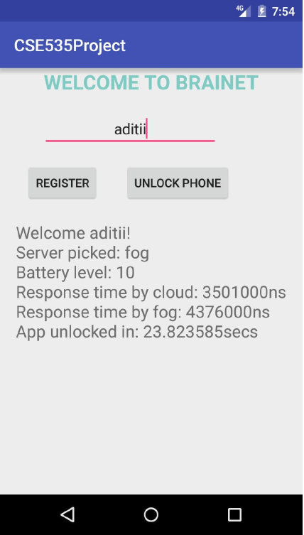
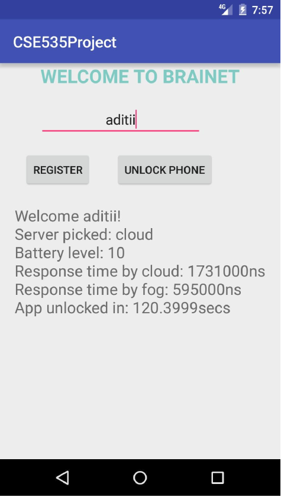

## BraiNetMCProject

This project is about using brain signals to do privacy management for smartphones. This is similar to FaceID in iPhone X but instead of using face image you use brain signals. We can call it “Thought ID”. 

Project uses EEG signals to unlock phone for each user. The data has been taken from [physionet.org](https://physionet.org/physiobank/database/eegmmidb/). 

Uses SVM to train and compare against the users for authentication.

The project consists of the followiing modules and functionalities:

**Phase 1**: Developing a UI to show image/video stimulus and obtain brain data. The video stimulus is to instruct the user to close their eyes and relax.

**Phase 2**: Remote server setup and deploying authentication algorithm.

**Phase 3**: Setting up a fog server and developing an adaptive offloading algorithm to derive when to use fog server

**Phase 4**: Performance analysis using fog server vs. cloud server for the database.

